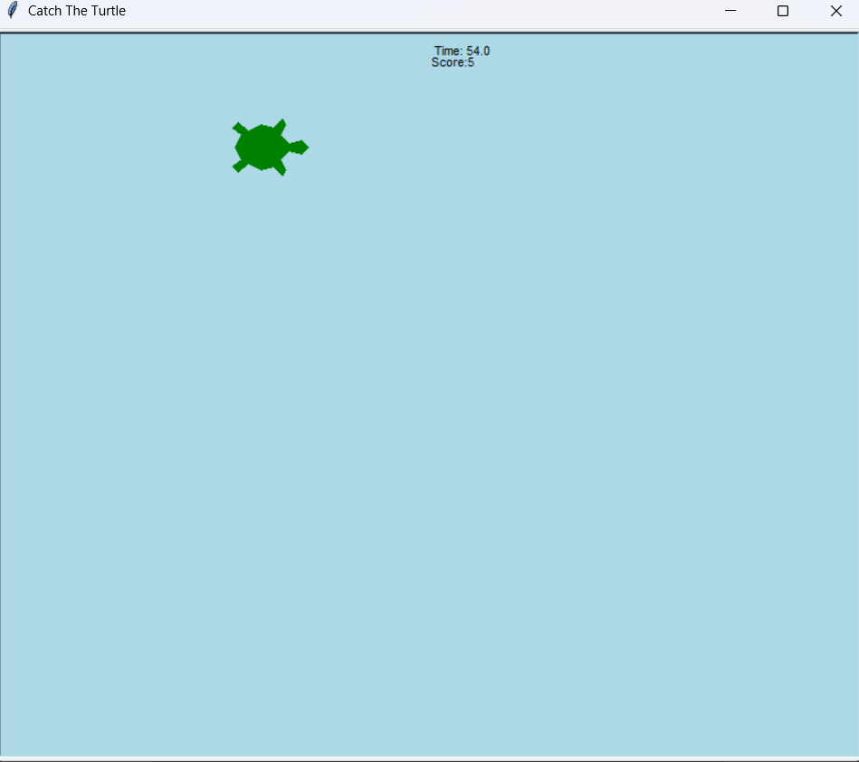
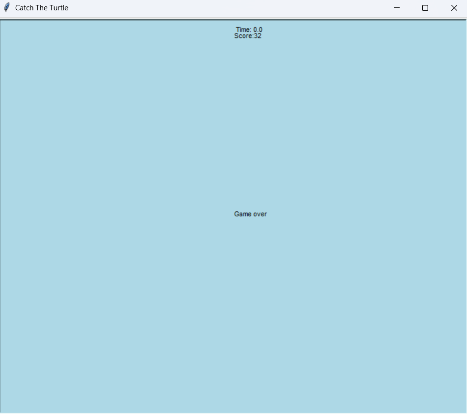

# 🐢 Catch The Turtle - Reflex Arcade Game

A 2D arcade-style reflex game developed using **Python** and the **Turtle** module. The game features dynamic target spawning, countdown logic, and real-time score tracking built with clean procedural programming.

## 📸 Screenshots

| Gameplay Action                         | Game Over Screen                        |
| :-------------------------------------: | :-------------------------------------: |
|   |  |
| *Dynamic spawning and reflex tracking*  | *Scoreboard and restart logic*          |

## 🕹️ Controls

| Input                | Action                                  |
| :------------------: | :-------------------------------------: |
| **Mouse Left Click** | Catch (Click) the Turtle to gain points |

## 🎮 Game Features
Based on the project requirements and implementation:

* **Dynamic Spawning System:**
    * Targets spawn at random coordinates within the screen boundaries.
    * Automatic respawn timer ensures continuous gameplay flow.
* **Player Interaction:**
    * **Click Detection:** Precise hitbox detection for mouse interactions.
    * **Instant Feedback:** Score updates immediately upon successful capture.
* **UI & Game States:**
    * **Real-time Scoreboard:** Displays current score dynamically at the top.
    * **Countdown Timer:** Integrated game loop that stops interaction when time runs out.
    * **Game Over Screen:** Displays final score and halts gameplay.

## 🛠️ Technologies Used
* **Language:** Python 3+
* **GUI Module:** Python Turtle Graphics
* **Core Modules:** `random` (Coordinate logic), `time` (Countdown loops)
* **IDE:** VS Code / PyCharm

## 🚀 How to Run
1.  Clone the repository.
2.  Open the project in your IDE or Terminal.
3.  Run the `main.py` file:
    ```bash
    python main.py
    ```
4.  Test your reflexes!

---
*Developed by Alperen Can Erdem*
